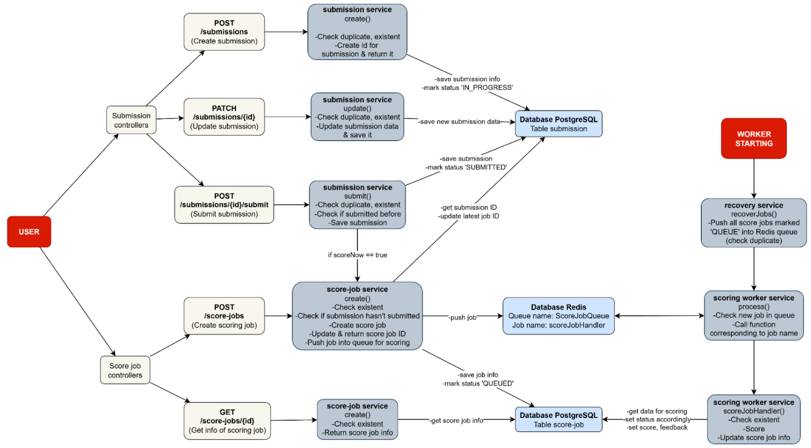

# 1. Description
This project is an **Assessment Engine** designed to handle learner submissions for simulations, process scoring jobs asynchronously using a queue system, and provide feedback based on the scoring results. It is built using NestJS, TypeORM, PostgreSQL, and BullMQ with Redis as the message broker.

# 2. Setup instructions (Run locally)

## Database setup
- PostgreSQL setup
  - Install PostgreSQL
  - Create database `assessment_engine`
- Redis setup
  - Install Redis
  - Start Redis server on default port 6379

## Environment variables setup
- Create a `.env` file in the project root based on the `.env.example` template.

## Install dependencies
```bash
$ npm install
```

## Compile and run the project
```bash
# development
$ npm run start

# watch mode
$ npm run start:dev
```

## Run tests (Haven't been implemented yet)

```bash
# unit tests
$ npm run test

# e2e tests
$ npm run test:e2e

# test coverage
$ npm run test:cov
```

# Deployment
- Docker setup
  - Ensure Docker and Docker Compose are installed.
  - Build and run the Docker containers using:
    ```bash
    $ docker-compose up --build
    ```


# Architecture Overview


# API Documentation
The API documentation is available at `/docs` endpoint when the server is running or at `openapi.yaml` file in the project root.

# Design decisions and trade-offs

## PostgreSQL database schema

### Table: `submission`
**Description**: Stores learner submissions for a simulation. Each submission may have multiple score jobs.


| Column                 | Type                                   | Description                                               |
|------------------------|-----------------------------------------|-----------------------------------------------------------|
| `id`                   | `uuid`                                  | Primary key.                                              |
| `learner_id`           | `uuid`                                  | ID of learner who created the submission.             |
| `simulation_id`        | `uuid`                                  | ID of simulation this submission belongs to.          |
| `latest_score_job_id`  | `uuid` (nullable)                       | ID of the most recent score job linked to this submission.|
| `status`               | `enum(IN_PROGRESS, SUBMITTED)`          | Current status of the submission.                         |
| `data`                 | `jsonb` (nullable)                      | Raw submission data from learner.                         |
| `metadata`             | `jsonb` (nullable)                      | Additional metadata.                                      |
| `created_at`           | `timestamp`                             | Timestamp when submission was created.                |
| `updated_at`           | `timestamp`                             | Timestamp of last update.                             |


### 🧩 Table: `score_job`

**Description**: Stores individual scoring jobs processed by the system. A submission can generate multiple score jobs.

| Column          | Type                              | Description                                            |
|-----------------|------------------------------------|--------------------------------------------------------|
| `id`            | `uuid`                             | Primary key.                                           |
| `submission_id` | `uuid`                             | Foreign key referencing `submission.id`.               |
| `learner_id`    | `uuid`                             | ID of learner (duplicated for fast lookup).               |
| `simulation_id` | `uuid`                             | ID of simulation (duplicated for fast lookup).            |
| `data`          | `jsonb` (nullable)                 | Input data used for scoring.                           |
| `status`        | `enum(QUEUED, RUNNING, DONE, ERROR)` | Current processing state of job.                   |
| `score`         | `float` (nullable)                 | Final score after processing.                          |
| `feedback`      | `text` (nullable)                  | Feedback returned to learner.                          |
| `error_message` | `text` (nullable)                  | Error details if job failed.                       |
| `metadata`      | `jsonb` (nullable)                 | Additional metadata.                                   |
| `created_at`    | `timestamp`                        | Timestamp when job was created.                    |
| `updated_at`    | `timestamp`                        | Timestamp when job was last updated.               |

>Why keep duplicate columns learnerId, simulationId in both table `submission` and `score_job`?
>- For example, if there is a ranking list, then the requirement is to know who this scored article belongs to and which simulation it belongs to.
>- So keep learnerId, simulationId in score_job to limit join to table submission to get the above information

### Pros
- Keep duplicate columns learnerId, simulationId:
  - Reduced overhead since no need to JOIN `score_job` with `submission`. 
  - Faster queries when filtering `score_job` by learner or simulation.
- Using jsonb for data and metadata: 
  - Flexibility for storing extra fields. 
  - No need to modify schemas frequently.
- Each scoring attempt is stored separately in `score_job`:
  - Maintain a full history of scoring attempts.
  - Re-score a submission without overwriting past results.

### Cons
- While flexible, jsonb fields have downsides:
  - Harder to query specific attributes within jsonb.
  - Over time, it may become a dumping ground for arbitrary data.

>How to improve: Identify common patterns and consider normalizing into separate columns/tables if needed.

---
### Queue Architecture (BullMQ + Redis)

This service uses **BullMQ** as the job queue system and **Redis** as the message broker.  
The queue is responsible for processing scoring jobs (`ScoreJob`) asynchronously and reliably.

**Queue Name**: `scoreJobQueue`

**Job Structure**: Each job added to the queue contains the following payload:

```json
{
  "jobId": "<UUID>",
  "submissionId": "<UUID>"
}
//check duplicate by jobId
```
### Pros
- Asynchronous and Non-Blocking: Heavy scoring tasks are offloaded to BullMQ workers, preventing the API server from blocking.

- Reliable Job Processing: Jobs survive server restarts and can be retried based on configured attempts/backoff + recovery logic mechanism in code.

- Scalable Worker Architecture: Workers can be scaled horizontally to handle higher scoring throughput. Queue concurrency can be tuned ({ concurrency: N }) without modifying API logic.

### Cons
- Potential Bottleneck: 
  - Redis is single-threaded; heavy queue operations or large payloads may degrade performance.
  - Each Redis job requires loading data for scoring in table `score_job`.
- Redis Memory Consumption: Large job payloads or slow cleanup strategy can increase memory usage.

> How to improve:
> - Consider pushing `data` field for scoring to the queue:
>   - -> Don't need to pull data from DB again in the worker
>   - -> Worker can score multiple jobIds. Then batch update score + feedback into table `score_job` later to reduce DB calls.


---
# TODOs

- [x] API for submissions
  - [x] POST /submissions to create a submission
  - [x] GET /submissions/:id to get submission status/data
  - [x] PATCH /submissions/:id to update submission data

- [x] API for scoring jobs
  - [x] POST /scoring-jobs handler enqueues job
  - [x] GET /scoring-jobs/:id handler checks job status
  - [x] ensure idempotency / deduplication
  - [x] implement retry/backoff and dead-letter handling
- [x] Implement worker
  - [x] pull jobs, process submissions, acknowledge/fail correctly
  - [x] support concurrency limits and graceful shutdown
  - [x] surface processing errors for retries / DLQ
- [x] Add structured logging
  - [x] use nestjs logger
  - [x] log job lifecycle events (enqueue, start, complete, fail)
  - [x] attach request IDs / correlation IDs to logs
- [x] Document all endpoints
  - [x] OpenAPI
  - [x] Swagger docs
- [ ] Add tests
  - [ ] unit tests for submission handler / validation
  - [ ] integration tests for enqueue -> worker flow (use test queue or in-memory)
  - [ ] e2e tests for API endpoints
  - [ ] enforce coverage thresholds in CI
- [x] Dockerize the application
  - [x] create Dockerfile for API + worker
  - [x] setup docker-compose for local development with dependencies (DB, queue)
  - [x] document how to run with Docker